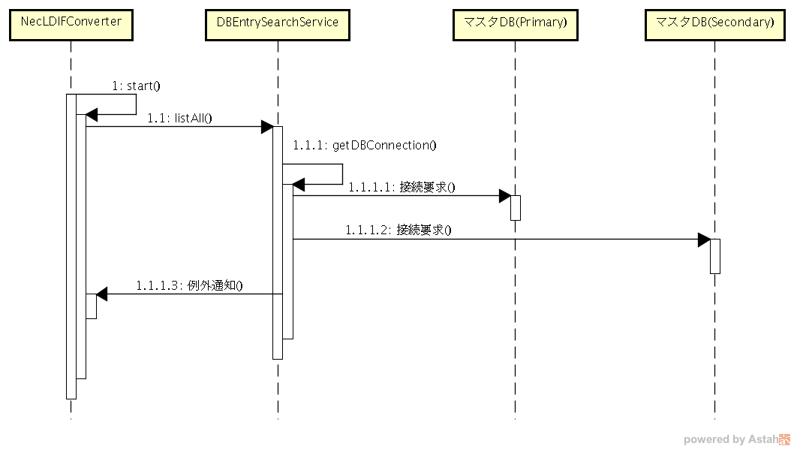
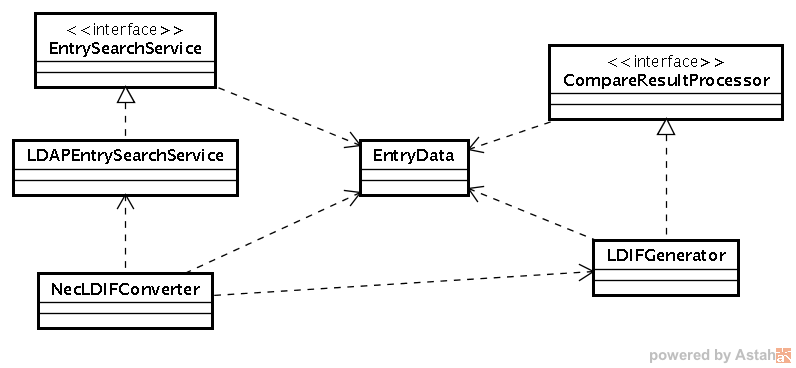

文書番号：xxxx

詳細設計仕様書

第0.15版

最終更新日：2018/07/11

*配付先一覧*

[cols=",",options="header",]
|===
|*関係G／関係者名* |*配付方法*
| |
| |
| |
| |
| |
| |
| |
|===

株式会社おけら開発

*改版履歴*

[cols=",,,,,,",]
|===
|*版数* |*発行年月日* |*改版内容* |*承認* |*査閲* |*作成* |*備考*
|0.01 |2018/06/18 |初版 |おけら開発 |おけら開発 |おけら開発 |
|0.06 |2018/06/20 |おけら開発レビュー反映 |おけら開発 |おけら開発 |おけら開発 |
|0.10 |2018/06/22 a|
KKKPFレビュー反映

・2.1 動作環境

Apache Commons CSVを削除しました。

・3.2.2 出力メッセージ

メッセージの定義および、DEBUGメッセージについて記述を追加しました。

*・図4 機能仕様フロー図*

マスタDB/CSVは、LDAP問い合わせ実行するように変更しました。

・図4.1.3 認証データ抽出 (マスタDB)のプライマリDBエラー時のシーケンス図　1.1.1.2

再接続について記述を追加しました。

・ 4.6 二重起動チェック機能

出力メッセージを追記しました。

・5 設定ファイル

JDBCの書式を修正

|おけら開発 |おけら開発 |おけら開発 |
|0.11 |2018/06/22 a|
図4.1.3 認証データ抽出 (マスタDB)のセカンダリDBエラー時のシーケンス図

を追加しました。

|おけら開発 |おけら開発 |おけら開発 |
|0.12 |2018/06/27 a|
・ネットワークドメイン名属性を追加

・キーを[個体識別番号@ネットワークドメイン名]に変更

図4.1.2 認証データ抽出機能(マスタDB)の正常処理時シーケンス図

図4.1.3 認証データ抽出 (マスタDB)のプライマリDBエラー時のシーケンス図

図4.1.3 認証データ抽出 (マスタDB)のセカンダリDBエラー時のシーケンス図

図4.1.4 認証データ抽出 (CSV)のシーケンス図

4.2.2 LDIFファイル作成機能

|おけら開発 |おけら開発 |おけら開発 |
|0.15 |2018/7/11 a|
基本設計変更に伴い変更

・4.5ログ出力機能　保存期間93日に変更

・5設定ファイル　世代管理数の範囲を0-2880、デフォルトを2232に変更

| | | |
|===

目次

link:#はじめに[[.underline]#1# [.underline]#はじめに# 4]

link:#入力文書[[.underline]#1.1# [.underline]#入力文書# 4]

link:#関連文書[[.underline]#1.2# [.underline]#関連文書# 4]

link:#システム構成[[.underline]#2# [.underline]#システム構成# 5]

link:#動作環境[[.underline]#2.1# [.underline]#動作環境# 5]

link:#コンポーネント図[[.underline]#2.2# [.underline]#コンポーネント図# 5]

link:#認証データ登録アプリケーション[[.underline]#2.2.1# [.underline]#認証データ登録アプリケーション# 5]

link:#コマンドインターフェース[[.underline]#3# [.underline]#コマンドインターフェース# 6]

link:#入力インターフェース[[.underline]#3.1# [.underline]#入力インターフェース# 6]

link:#出力インターフェース[[.underline]#3.2# [.underline]#出力インターフェース# 6]

link:#終了ステータ終了コード[[.underline]#3.2.1# [.underline]#終了ステータ(終了コード)# 6]

link:#出力メッセージ[[.underline]#3.2.2# [.underline]#出力メッセージ# 6]

link:#機能仕様[[.underline]#4# [.underline]#機能仕様# 9]

link:#認証データ抽出機能[[.underline]#4.1# [.underline]#認証データ抽出機能# 10]

link:#認証データ抽出マスタdb[[.underline]#4.1.1# [.underline]#認証データ抽出（マスタDB）# 10]

link:#認証データ抽出csv[[.underline]#4.1.2# [.underline]#認証データ抽出（CSV）# 13]

link:#認証データ変換機能[[.underline]#4.2# [.underline]#認証データ変換機能# 15]

link:#認証データ変換機能-1[[.underline]#4.2.1# [.underline]#認証データ変換機能# 16]

link:#ldifファイル作成機能[[.underline]#4.2.2# [.underline]#LDIFファイル作成機能# 17]

link:#認証データ登録機能[[.underline]#4.3# [.underline]#認証データ登録機能# 18]

link:#定期起動機能[[.underline]#4.4# [.underline]#定期起動機能# 18]

link:#ログ出力機能[[.underline]#4.5# [.underline]#ログ出力機能# 18]

link:#二重起動チェック機能[[.underline]#4.6# [.underline]#二重起動チェック機能# 19]

link:#暗号化復号化ツール[[.underline]#4.7# [.underline]#暗号化/復号化ツール# 20]

link:#シェルスクリプト[[.underline]#4.8# [.underline]#シェルスクリプト# 22]

link:#設定ファイル[[.underline]#5# [.underline]#設定ファイル# 23]

== はじめに

=== 入力文書

[cols=",,",]
|===
|文書番号 |版数 |文書名
| |0.15 a|
PⅢ 認証データ登録

基本設計書

|===

※上記以外に基本設計書の入力文書も含むものとします。

=== 関連文書

[cols=",,",]
|===
|文書番号 |版数 |文書名
| |1.0.0 |認証データ変換モジュールJavaDoc
| |1.0.0 |文字列の暗号化/復号化ツール JavaDoc
|===

※上記以外に基本設計書の関連文書も含むものとします。

==  +
システム構成

=== 動作環境

認証データ登録アプリケーションは、以下のOSSソフトウェアを用いて構築します。

[cols=",,,",options="header",]
|===
|項番 |分類 |利用OSSの名称 |バージョン
|1 |ログ出力 |Apache Log4J |2.11.0
|2 |JDBCドライバー |PostgreSQL JDBC Driver |42.2.2
|3 |入出力ユーティリティ |Apache Commons IO |2.6
|4 |文字列処理ユーティリティ |Apache Commons Lang |3.7
|===

=== コンポーネント図

==== 認証データ登録アプリケーション

image:media/media/image1.png[image,width=490,height=257]

図 2.2.1認証データ登録アプリケーションのコンポーネント図

[cols=",,",options="header",]
|===
|項番 |コンポーネント名 |内容
|1 |変換モジュール a|
本アプリケーション

マスタDBあるいは、認証データCSVファイルと、LDAPの情報を比較して、差分LDIFファイルを生成します。

|2 |マスタDB |認証データが格納されているデータベース。プライマリとセカンダリがあり、プライマリに接続できない場合は、セカンダリを使用します。
|3 |認証データCSVファイル |認証データが格納されているCSVファイル。
|4 |差分LDIFファイル |マスタDBあるいは、認証データCSVファイルとLDAPの情報比較した結果、LDAPを更新するためのデータを格納したLDIFファイル。
|===

== コマンドインターフェース

=== 入力インターフェース

基本設計書「3.1 入力インターフェース」の仕様に従い、起動時のパラメータをプログラムのメインメソッドに引き渡します。

本アプリケーションの実行プログラムを格納するKKKLDIFConverter.jarのJARファイルマニフェストを以下のように生成し、実行時のエントリークラス(com.KKK.jp.kldap.KKKLDIFConverter)を定義します。

META-INF/MANIFEST.MF

Manifest-Version: 1.0

Archiver-Version: Plexus Archiver

Created-By: Apache Maven

Built-By: developer

Build-Jdk: 1.8.0_171

Main-Class: com.KKK.jp.kldap.KKKLDIFConverter

=== 出力インターフェース

基本設計書「3.2 出力インターフェース」の仕様に従い、終了時のステータス、およびコンソールへの出力を行います。

==== 終了ステータ(終了コード)

終了コードは、正常終了時は、0。それ以外は、255とします。

※更新された認証データが存在しないときは、差分LDIFファイル生成されず、終了コードは、0となります。

==== 出力メッセージ

コンソールへの情報出力は、KKKLDIFConverter.jar実行時のクラスパス上の

log4j2.xml

で定義します。

log4j2.xmlの設定を以下の通り定義します。(網掛け部分がコンソール出力に関する定義)

<?xml version="1.0" encoding="UTF-8"?>

<Configuration status="WARN">

<CustomLevels>

<CustomLevel name="CRT" intLevel="0" />

<CustomLevel name="MAJOR" intLevel="100" />

<CustomLevel name="MINOR" intLevel="200" />

</CustomLevels>

<Appenders>

<Console name="Console" target="SYSTEM_OUT">

<PatternLayout

pattern="%d\{YYYY/MM/dd HH:mm:ss.SSS},%level,%msg%n" />

</Console>

<RollingRandomAccessFile name="FileLog"

fileName="logs/KKKLDIFConverter.log"

filePattern="logs/KKKLDIFConverter-%d\{yyyyMMdd}-%i.log">

<PatternLayout

pattern="%d\{YYYY/MM/dd HH:mm:ss.SSS},%level,%msg%n" />

<Policies>

<SizeBasedTriggeringPolicy size="10 MB" />

<TimeBasedTriggeringPolicy />

<DefaultRolloverStrategy fileIndex="max" min="1" >

<Delete basePath="logs" maxDepth="1">

<IfLastModified age="93d" />

</Delete>

</DefaultRolloverStrategy>

</Policies>

</RollingRandomAccessFile>

</Appenders>

<Loggers>

<Root level="DEBUG">

<AppenderRef ref="Console" level="TRACE" />

<AppenderRef ref="FileLog" level="TRACE" />

</Root>

</Loggers>

</Configuration>

　コンソールに表示するメッセージの定義は、KKKLDIFConverter.jar ファイル内のリソースファイルとして、

com/KKK/jp/kldap/messages.properties

で行います。

定義内容は、基本設計書「3.2出力インターフェース」「3.2.2.3メッセージ」の内容に従い、以下のように定義します。

CRIT001=アプリケーションの初期化に失敗しました。システム管理者に連絡してください。

CRIT002=引数の指定が不正です。引数の指定を見直して再度実行してください。

CRIT003=起動確認のための一時ファイルの削除が行えませんでした。%sを削除した後に再度実行してください。

CRIT004=指定したCSVファイルが存在しません。CSVファイルのパスを見直し再度実行してください。

CRIT005=指定したCSVファイルを読み込めません。アクセス権などを見直し再度実行してください。

CRIT006=指定したCSVファイルの内容にエラーがあります。内容を見直し再度実行してください。\n%s

CRIT007=マスタDBへの接続に失敗しました。システム管理者に連絡してください。

CRIT008=LDIFファイルへの変換に失敗しました。システム管理者に連絡してください。

CRIT009=起動確認のための一時ファイルの削除が行えませんでした。

CRIT010=マスタDBの内容にエラーがあります。対象のレコードは処理されません。\n%s

CRIT999=アプリケーションの処理に失敗しました。システム管理者に連絡してください。

MAJOR001=プライマリのマスタDBへの接続に失敗しました。セカンダリのマスタDBに接続します。

MINOR001=二重起動です。実行中のアプリケーションが終了した後に再度実行してください。

INFO001=処理を開始します。

INFO002=プライマリのマスタDBに接続しました。

INFO003=セカンダリのマスタDBに接続しました。

INFO004=マスタDBから%d件のデータを取得しました。

INFO005=CSVファイルから%d件のデータを読み込みました。

INFO006=LDIFファイルへの変換に成功しました。新規登録=%d件、更新=%d件、削除=%d件。

INFO007=処理を終了します。

DEBUGメッセージは、製造時に以下の条件で障害時に原因調査に有用と思われるメッセージを出力することとします。

・設定ファイルの不備の原因となっている箇所

・引数の不備の原因となっている箇所

・ファイル読み込み、通信エラー、発生箇所を特定が必要となる箇所

・その他、想定しない障害発生時に問題箇所の特定するための情報

DEBUG001=起動パラメータの数が不正です。

DEBUG002=第2引数が不正です。

DEBUG003=設定ファイルが読み込みません。

DEBUG004=起動確認のための一時ファイルの作成が行えませんでした。

DEBUG005=設定ファイルの読み込みに失敗しました。

DEBUG006=指定したCSVファイルのヘッダーの書式が異なります。

DEBUG007=指定したCSVファイルの読み込みに失敗しました。

DEBUG008=指定したCSVファイルの%d行目の書式が異なります。%s

DEBUG009=LDIFテンプレートの読み込みに失敗しました。

DEBUG010=出力ファイルの世代管理の処理に失敗しました。

DEBUG011=マスタDBの接続に問題があります。

DEBUG012=マスタDBの検索に問題があります。

DEBUG013=マスタDBの接続に失敗しました。

DEBUG014=LDAPから %d件のデータを読み込みました。

DEBUG015=LDIFファイルの書き込みに失敗しました。

DEBUG016=LDAPに接続できませんでした。

DEBUG017=LDAPの検索検索に失敗しました。

DEBUG018=LDAPから取得したデータに属性がありません。

DEBUG019=LDAPの検索結果の処理に失敗しました。

DEBUG020=LDAPに接続しました。

DEBUG021=LDAPから取得したデータcnの書式に問題があります。

DEBUG022=入力マスタ検証で問題を検出しました。

DEBUG023=マスタDBに再接続を試みます。retryCount(%d/%d)

== 機能仕様

本章では機能ごとの詳細設計について説明します。

実行から、終了までの正常処理のフローは以下の通りです。

図4 機能仕様フロー図

[cols=",,",options="header",]
|===
|項番 |処理名 |処理内容
|1 |起動 |コマンドラインからプログラムを実行し、エントリークラスcom.KKK.jp.kldap.KKKLDIFConverterクラスのmainメソッドが呼び出される。
|2 |二重起動防止処理 a|
二重起動されていないかを確認

二重起動防止のためのファイルを生成

「4.6二重起動チェック機能」を参照

|3 |起動パラメータの確認 a|
mainメソッドの引数を確認

基本設計書「3.1 入力インターフェース」を参照

|4 |設定ファイルの読込 a|
設定ファイルの読み込み処理

「5設定ファイル」を参照

|5 |処理開始 |起動パラメータ、設定ファイルに応じて、処理インスタンスを生成し、処理を開始
|6 |差分LDIFの世代管理を実行 |生成済み差分LDIFファイルをバックアップに移動し、世代数を超えている場合は、一番古いファイルを削除し、世代番号の採番を振り直して、バックアップの各ファイル名を変更します。
|7 |マスタDBあるいは認証データCSVから認証データをすべて取得 |設定ファイルに記載されているデータベースの情報、あるいは起動パラメータのCSVファイルの情報から、すべての認証情報を取得する。
|8 |LDAPから認証データをすべて取得 |設定ファイルに記載されているLDAPの情報から、すべての認証情報を取得する。
|9 |差分比較処理を実行 |取得した情報を比較し、設定ファイル、起動パラメータに応じて、差分LDIFファイルを出力する。
|10 |終了 |二重起動防止のために、生成したファイルを削除し、処理を終了する。
|===

機能を実現するJavaクラス、インターフェースのパッケージ名は、

com.KKK.jp.kldap

とします。

=== 認証データ抽出機能

認証データ抽出機能に関連するクラス図を以下に示します。マスタDBのテーブルから情報を取得する機能と、認証データCSVファイルから読み出す機能を実装します。

各クラスの機能の詳細については、JavaDocを参照してください。

image:media/media/image2.png[image,width=513,height=338]

図4.1.1 認証データ抽出機能クラス図

==== 認証データ抽出（マスタDB）

認証データ抽出機能(マスタDB)の正常処理時のシーケンス図を以下に示します。

image:media/media/image3.png[image,width=522,height=389]

図4.1.2 認証データ抽出機能(マスタDB)の正常処理時シーケンス図

[cols=",",options="header",]
|===
|項番 |処理内容
|1 |エントリークラスのインスタンスであるKKKLDIFConverterのmainメソッドから、startメソッドを呼び出します。
|1.1 |基本設計書「4.1.1.認証データ抽出（マスタDB）」にしたがって、DBEntrySearchSeviceインスタンスに対して、listAllメソッドを呼び出し、マスタDBに格納されている認証データをすべて取得し、データ端末の[個体識別番号@ネットワークドメイン名]をキーにして、認証データ(EntryData)を格納したMapインスタンスを生成します。
|1.1.1 |マスタDBの接続を行います。
|1.1.1.1 |マスタDB(Primary)の接続を要求しコネクションを取得します。
|1.1.2 |マスタDB(Primary)に対して、検索を実行し検索結果として、認証データを取得します。
|===

認証データ抽出 (マスタDB)のプライマリDBエラー時のシーケンス図を以下に示します。

image:media/media/image4.png[image,width=642,height=411]

図4.1.3 認証データ抽出 (マスタDB)のプライマリDBエラー時のシーケンス図

[cols=",",options="header",]
|===
|項番 |処理内容
|1 |エントリークラスのインスタンスであるKKKLDIFConverterのmainメソッドから、startメソッドを呼び出します。
|1.1 |基本設計書「4.1.1.認証データ抽出（マスタDB）」にしたがって、DBEntrySearchSeviceインスタンスに対して、listAllメソッドを呼び出し、マスタDBに格納されている認証データをすべて取得し、データ端末の[個体識別番号@ネットワークドメイン名]をキーにして、認証データ(EntryData)を格納したMapインスタンスを生成します。
|1.1.1 |マスタDBの接続を行います。
|1.1.1.1 a|
マスタDB(Primary)の接続を要求しコネクションを取得します。

設定”マスタDBの接続リトライ回数”、再接続できるまで、設定”マスタDBの接続リトライ間隔(秒)”間隔で実行します。

|1.1.1.2 |マスタDB(Primary)の接続を行えなかった場合、マスタDB(Secondary)に接続を要求し、コネクションを取得します。
|1.1.2 |マスタDB(Secondary)に対して、検索を実行し検索結果として、認証データを取得します。
|===

認証データ抽出 (マスタDB)のセカンダリDBエラー時のシーケンス図を以下に示します。

図4.1.3 認証データ抽出 (マスタDB)のセカンダリDBエラー時のシーケンス図

[cols=",",options="header",]
|===
|項番 |処理内容
|1 |エントリークラスのインスタンスであるKKKLDIFConverterのmainメソッドから、startメソッドを呼び出します。
|1.1 |基本設計書「4.1.1.認証データ抽出（マスタDB）」にしたがって、DBEntrySearchSeviceインスタンスに対して、listAllメソッドを呼び出し、マスタDBに格納されている認証データをすべて取得し、データ端末の[個体識別番号@ネットワークドメイン名]をキーにして、認証データ(EntryData)を格納したMapインスタンスを生成します。
|1.1.1 |マスタDBの接続を行います。
|1.1.1.1 a|
マスタDB(Primary)の接続を要求しコネクションを取得します。

設定”マスタDBの接続リトライ回数”、再接続できるまで、設定”マスタDBの接続リトライ間隔(秒)”間隔で実行します。

|1.1.1.2 a|
マスタDB(Primary)の接続を行えなかった場合、マスタDB(Secondary)に接続を要求し、コネクションを取得します。

設定”マスタDBの接続リトライ回数”、再接続できるまで、設定”マスタDBの接続リトライ間隔(秒)”間隔で実行します。

|1.1.3 |マスタDB(Secondary)の接続を行えなかった場合、例外をKKKLDIFConveterに通知します。
|===

==== 認証データ抽出（CSV）

認証データ抽出 (CSV)のシーケンス図を以下に示します。

image:media/media/image6.png[image,width=541,height=349]

図4.1.4 認証データ抽出 (CSV)のシーケンス図

[cols=",",options="header",]
|===
|項番 |処理内容
|1 |エントリークラスのインスタンスであるKKKLDIFConverterのmainメソッドから、startFromCSVメソッドを呼び出します。
|1.1 |CSVEntrySearchSeviceインスタンスに対して、listAllメソッドを呼び出します。
|1.1.1 |基本設計書「4.1.2.認証データ抽出（CSV）」にしたがって、認証データCSVファイルに格納されている認証データをすべて取得し、データ端末の[個体識別番号@ネットワークドメイン名]をキーにして、認証データ(EntryData)を格納したMapインスタンスを生成します。
|1.1.2 |CSVファイルの行毎のデータをパースし、EntryDataクラスに変換します。
|===

=== 認証データ変換機能

認証データ変換機能に関連するクラス図を以下に示します。

各クラスの機能の詳細については、JavaDocを参照してください。

図4.2 認証データ変換機能のクラス図

認証データ変換機能のシーケンス図を以下に示します。

image:media/media/image8.png[image,width=633,height=508]

図4.2.1 認証データ変換機能のシーケンス図

[cols=",",options="header",]
|===
|項番 |処理内容
|1 |生成済みの差分LDIFファイルをバックアップに移動し、基本設計「4.2認証データ変換機能」「4.2.1LDIFファイル作成機能」の仕様に従って、バックアップの世代管理を行います。
|2 |起動オプションに応じて、startメソッドあるいは、startFromCSVメソッドから、処理に対応するEntrySearchServiceインスタンスに対して、マスタ認証データ取得のためにlistAllメソッドを呼び出します。
|3 |比較対象となるLDAPから認証データを取得するために、LDAPSearchEntryServiceインスタンスに対して、listAllメソッドを呼び出します。
|3.1 |設定ファイルに定義されているLDAPサーバに対して、検索処理を実行し、検索結果を取得します。
|4 |取得したマスタ認証データと比較対象となる認証データ比較のために、LDIFGeneratorインスタンスに対して、compareEntryDataメソッドを呼び出します。
|4.1 |マスタ認証データと認証データを比較し、新規追加、更新、削除、更新無しの判定を行います。
|4.2 |新規追加、更新、削除の場合、マスタ認証データとLDIFテンプレートを持ちいて、基本設計「4.2認証データ変換機能」「4.2.1LDIFファイル作成機能」の仕様に従って、差分LDIFファイルを生成し、生成件数を比較結果毎に返します。
|===

==== 認証データ変換機能

差分抽出、認証データ抽出は、CompareResultProcessorインターフェースのcompareEntryDataメソッドで、基本設計書「4.2認証データ変換機能」「4.2.1差分抽出機能」の仕様に従って判定を行います。

==== LDIFファイル作成機能

基本設計書「4.2認証データ変換機能」「4.2.2 LDIFファイル作成機能」の仕様にファイルを作成します。

KKKLDIFConverter.jar内の以下のテンプレートファイルの文字列を置換することで、差分LDIFファイルの生成を行います。

[cols=",,",options="header",]
|===
|項番 |ファイル名 |目的
|1 |com/KKK/jp/kldap/template_add.ldif |新規登録用のLDIFテンプレート
|2 |com/KKK/jp/kldap/template_modify.ldif |更新用のLDIFテンプレート
|3 |com/KKK/jp/kldap/template_delete.ldif |削除用のLDIFテンプレート
|===

置換文字列は、以下の通りです。

[cols=",,",options="header",]
|===
|項番 |置換文字列 |
|1 |$\{CN} |[個体識別番号@ネットワークドメイン名]
|2 |$\{BASEDN} |データのDN
|3 |$\{REGISTERADDRESS} |IPアドレス(物理)
|4 |$\{STREETADDRESS} |ネットマスク
|5 |$\{USERPASSWORD} |パスワード
|===

* 新規登録用のLDIFテンプレート template_add.ldif

[.underline]#dn#: [.underline]#cn#=$\{CN},$\{BASEDN}

[.underline]#changetype#: add

[.underline]#objectclass#: top

[.underline]#objectclass#: person

[.underline]#objectclass#: organizationalPerson

[.underline]#cn#: $\{CN}

[.underline]#sn#: $\{CN}

registeredAddress: $\{REGISTEREDADDRESS}

streetAddress: $\{STREETADDRESS}

userPassword: $\{USERPASSWORD}

* 更新用のLDIFテンプレート template_modify.ldif

[.underline]#dn#: [.underline]#cn#=$\{CN},$\{BASEDN}

[.underline]#changetype#: modify

replace: registeredAddress

registeredAddress: $\{REGISTEREDADDRESS}

-

replace: streetAddress

streetAddress: $\{STREETADDRESS}

-

replace: userPassword

userPassword: $\{USERPASSWORD}

* 削除用のLDIFテンプレートtemplate_delete.ldif

dn: cn=$\{CN},$\{BASEDN}

changetype: delete

=== 認証データ登録機能

認証データの登録は、OpenLDAPのldapmodifyコマンドを利用して、認証データ変換機能で生成したファイルを登録します。

=== 定期起動機能

基本設計書「4.4定期起動機能」に従って、定期起動機能は、「4.8シェルスクリプト」で作成するシェルスクリプトをrootのcrontabに登録する事で実現します。

=== ログ出力機能

「3.2出力インターフェース」でコンソールに出力している内容をLog4Jの設定を用いてファイルに出力します。

ログ出力は、KKKLDIFConverter.jar実行時のクラスパス上の

log4j2.xml

で定義します。

log4j2.xmlの設定を以下の通り定義します。(網掛け部分がファイル出力に関する定義)

<?xml version="1.0" encoding="UTF-8"?>

<Configuration status="WARN">

<CustomLevels>

<CustomLevel name="CRT" intLevel="0" />

<CustomLevel name="MAJOR" intLevel="100" />

<CustomLevel name="MINOR" intLevel="200" />

</CustomLevels>

<Appenders>

<Console name="Console" target="SYSTEM_OUT">

<PatternLayout

pattern="%d\{YYYY/MM/dd HH:mm:ss.SSS},%level,%msg%n" />

</Console>

<RollingRandomAccessFile name="FileLog"

fileName="logs/KKKLDIFConverter.log"

filePattern="logs/KKKLDIFConverter-%d\{yyyyMMdd}-%i.log">

<PatternLayout

pattern="%d\{YYYY/MM/dd HH:mm:ss.SSS},%level,%msg%n" />

<Policies>

<SizeBasedTriggeringPolicy size="10 MB" />

<TimeBasedTriggeringPolicy />

<DefaultRolloverStrategy fileIndex="max" min="1" >

<Delete basePath="logs" maxDepth="1">

<IfLastModified age="93d" />

</Delete>

</DefaultRolloverStrategy>

</Policies>

</RollingRandomAccessFile>

</Appenders>

<Loggers>

<Root level="DEBUG">

<AppenderRef ref="Console" level="TRACE" />

<AppenderRef ref="FileLog" level="TRACE" />

</Root>

</Loggers>

</Configuration>

=== 二重起動チェック機能

本アプリケーション起動時に、

/tmp/KKKLDIFConverter_PID

にプロセスIDを格納したファイルを生成し、処理終了時に削除します。

起動時に、上記ファイルが存在する場合は、起動中と判定し、コンソール、ログファイルに下記の例のようにメッセージを出力し、起動を中止します。

2018/06/21 17:21:58.403,MINOR,二重起動です。実行中のアプリケーションが終了した後に再度実行してください。

=== 暗号化/復号化ツール

基本設計書「4.7 暗号化/復号化ツール」の仕様に従って、設定ファイルで使用するID、パスワードを暗号化、復号化するKKKCrypt.jarのJARファイルマニフェストを以下のように記述し、実行時のエントリークラス(com.KKK.jp.kldap.KKKCrypt)を定義します。

META-INF/MANIFEST.MF

Manifest-Version: 1.0

Built-By: developer

Created-By: Apache Maven 3.5.3

Build-Jdk: 1.8.0_171

Main-Class: com.KKK.jp.kldap.KKKCrypt

設定ファイルで使用するID、パスワードを暗号化、復号化するツールのクラス図を以下に示します。

クラスの機能の詳細については、JavaDocを参照してください。

図4.7 暗号化/復号化ツールクラス図

暗号化文字列生成処理のシーケンス図を以下に示します。

図4.7.1 暗号化文字列生成処理のシーケンス図

復号化文字列生成処理のシーケンスを以下に示します。

図4.7.2 復号化文字列生成処理のシーケンス図

=== シェルスクリプト

基本設計書「4.8シェルスクリプト」の仕様に従って、以下のフローのシェルスクリプト(KKKLdapTool.sh)を作成します。

以下の設定は、KKKLdapTool.shで定義する環境変数を変更することで行います。rootユーザでのみ実行可能とします。

[cols=",,",options="header",]
|===
|項番 |環境変数名 |内容
|1 |KKKLDAP_TOOL |KKKLDAPConverter.jarの絶対パス
|2 |KKKLDAP_TOOL_LDIF_FILE |KKKLDAPConverter.jarが、出力する差分LDIFファイル
|3 |KKKLDAP_TOOL_URL |格納先のLDAPのURL
|4 |KKKLDAP_TOOL_ARG1 |KKKLDAPConverter.jar 第一引数
|5 |KKKLDAP_TOOL_ARG2 |KKKLDAPConverter.jar 第二引数
|6 |KKKLDAP_TOOL_ARG3 |KKKLDAPConverter.jar 第三引数
|===

== 設定ファイル

基本設計書「5設定ファイル」「表5-1設定ファイル仕様」に従って設定ファイルの検証および、読み込みを行います。

[cols=",,,,,",options="header",]
|===
|項番 |項目名 |復号化対象 |必須 |デフォルト |内容
|1 |PrimaryConKKKtionStrings |○ |○ | a|
プライマリのマスタDBの接続文字列

フォーマット：jdbc:postgresql://[ホスト名もしくはIPアドレス]:[ポート番号(デフォルト：5432)/[データベース名]?user=[ID]&password=[パスワード]

例)

jdbc:postgresql://localhost:5432/mstdb?user=postgres&password= pass123@

|2 |SecondaryConKKKtionStrings |○ |○ | a|
セカンダリのマスタDBの接続文字列

フォーマット：jdbc:postgresql://[ホスト名もしくはIPアドレス]:[ポート番号(デフォルト：5432)/[データベース名]?user=[ID]&password=[パスワード]

例)

jdbc:postgresql://localhost:5432/mstdb?user=postgres&password= pass123@

|3 |DBConKKKtionRetryCount | | |3 a|
マスタDBの接続リトライ回数

半角数字0～10の範囲で設定可

|4 |DBConKKKtionRetryInterval | | |30 a|
マスタDBの接続リトライ間隔(秒)

半角数字0～180の範囲で設定可

|5 |LdapURL | | |ldap://localhost:389 |差分抽出時に接続するLDAPのURL
|6 |LdapBaseDN | | |dc=maxcrc,dc=com |差分抽出時にデータを取得するDN
|7 |LdapUserName |○ | |cn=Manager,dc=maxcrc,dc=com |差分抽出時に接続するLDAPの認証ユーザID
|8 |LdapPassword |○ | |secret |差分抽出時に接続するLDAPの認証パスワード
|9 |LDIFPath | | |/var/app/KKK/LDIFConverter/ |LDIFファイルの出力先
|10 |LDIFFileName | | |radius.ldif |LDIFファイルの出力ファイル名
|11 |LDIFMaxBackup | | |2232 a|
LDIFファイルの世代管理数

半角数字0～2880の範囲で設定可

|===

設定ファイル読み込みに関連するクラス図を以下に示します。

各クラスの機能の詳細については、JavaDocを参照してください。

図5 設定ファイルクラス図

設定ファイル読込処理のシーケンス図を以下に示します。

図5.1 設定ファイル読込処理のシーケンス図
