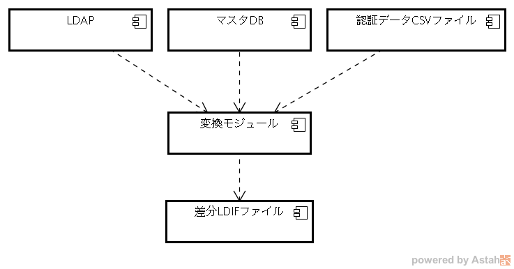

=== コンポーネント図

==== 認証データ登録アプリケーション

図 2.2.1認証データ登録アプリケーションのコンポーネント図

[cols=",,",options="header",]
|===
|項番 |コンポーネント名 |内容
|1 |変換モジュール a|
本アプリケーション

マスタDBあるいは、認証データCSVファイルと、LDAPの情報を比較して、差分LDIFファイルを生成します。

|2 |マスタDB |認証データが格納されているデータベース。プライマリとセカンダリがあり、プライマリに接続できない場合は、セカンダリを使用します。
|3 |認証データCSVファイル |認証データが格納されているCSVファイル。
|4 |差分LDIFファイル |マスタDBあるいは、認証データCSVファイルとLDAPの情報比較した結果、LDAPを更新するためのデータを格納したLDIFファイル。
|===
