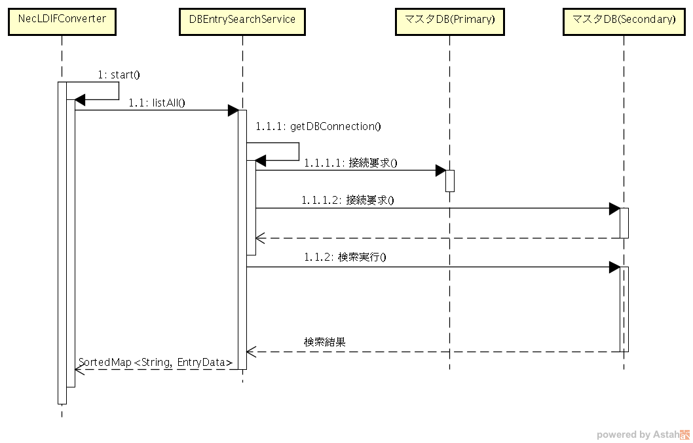

// == 機能仕様

本章では機能ごとの詳細設計について説明します。
実行から、終了までの正常処理のフローは以下の通りです。

[cols=",,",options="header",]
|===
|項番 |処理名 |処理内容
|1 |起動 |コマンドラインからプログラムを実行し、エントリークラスcom.KKK.jp.kldap.KKKLDIFConverterクラスのmainメソッドが呼び出される。
|2 |二重起動防止処理 a|
二重起動されていないかを確認

二重起動防止のためのファイルを生成

「4.6二重起動チェック機能」を参照

|3 |起動パラメータの確認 a|
mainメソッドの引数を確認

基本設計書「3.1 入力インターフェース」を参照

|4 |設定ファイルの読込 a|
設定ファイルの読み込み処理

「5設定ファイル」を参照

|5 |処理開始 |起動パラメータ、設定ファイルに応じて、処理インスタンスを生成し、処理を開始
|6 |差分LDIFの世代管理を実行 |生成済み差分LDIFファイルをバックアップに移動し、世代数を超えている場合は、一番古いファイルを削除し、世代番号の採番を振り直して、バックアップの各ファイル名を変更します。
|7 |マスタDBあるいは認証データCSVから認証データをすべて取得 |設定ファイルに記載されているデータベースの情報、あるいは起動パラメータのCSVファイルの情報から、すべての認証情報を取得する。
|8 |LDAPから認証データをすべて取得 |設定ファイルに記載されているLDAPの情報から、すべての認証情報を取得する。
|9 |差分比較処理を実行 |取得した情報を比較し、設定ファイル、起動パラメータに応じて、差分LDIFファイルを出力する。
|10 |終了 |二重起動防止のために、生成したファイルを削除し、処理を終了する。
|===

機能を実現するJavaクラス、インターフェースのパッケージ名は、 `com.KKK.jp.kldap` とします。

=== 認証データ抽出機能

認証データ抽出機能に関連するクラス図を以下に示します。マスタDBのテーブルから情報を取得する機能と、
認証データCSVファイルから読み出す機能を実装します。
各クラスの機能の詳細については、JavaDocを参照してください。

.認証データ抽出機能クラス図

==== 認証データ抽出（マスタDB）

認証データ抽出機能(マスタDB)の正常処理時のシーケンス図を以下に示します。

.認証データ抽出機能(マスタDB)の正常処理時シーケンス図

[cols=",",options="header",]
|===
|項番 |処理内容
|1 |エントリークラスのインスタンスであるKKKLDIFConverterのmainメソッドから、startメソッドを呼び出します。
|1.1 |基本設計書「4.1.1.認証データ抽出（マスタDB）」にしたがって、DBEntrySearchSeviceインスタンスに対して、listAllメソッドを呼び出し、マスタDBに格納されている認証データをすべて取得し、データ端末の[個体識別番号@ネットワークドメイン名]をキーにして、認証データ(EntryData)を格納したMapインスタンスを生成します。
|1.1.1 |マスタDBの接続を行います。
|1.1.1.1 |マスタDB(Primary)の接続を要求しコネクションを取得します。
|1.1.2 |マスタDB(Primary)に対して、検索を実行し検索結果として、認証データを取得します。
|===

認証データ抽出 (マスタDB)のプライマリDBエラー時のシーケンス図を<<fig_primary_db_error>>以下に示します。

[[fig_primary_db_error]]
.認証データ抽出 (マスタDB)のプライマリDBエラー時のシーケンス図

[cols=",",options="header",]
|===
|項番 |処理内容
|1 |エントリークラスのインスタンスであるKKKLDIFConverterのmainメソッドから、startメソッドを呼び出します。
|1.1 |基本設計書「4.1.1.認証データ抽出（マスタDB）」にしたがって、DBEntrySearchSeviceインスタンスに対して、listAllメソッドを呼び出し、マスタDBに格納されている認証データをすべて取得し、データ端末の[個体識別番号@ネットワークドメイン名]をキーにして、認証データ(EntryData)を格納したMapインスタンスを生成します。
|1.1.1 |マスタDBの接続を行います。
|1.1.1.1 a|
マスタDB(Primary)の接続を要求しコネクションを取得します。

設定”マスタDBの接続リトライ回数”、再接続できるまで、設定”マスタDBの接続リトライ間隔(秒)”間隔で実行します。

|1.1.1.2 |マスタDB(Primary)の接続を行えなかった場合、マスタDB(Secondary)に接続を要求し、コネクションを取得します。
|1.1.2 |マスタDB(Secondary)に対して、検索を実行し検索結果として、認証データを取得します。
|===

認証データ抽出 (マスタDB)のセカンダリDBエラー時のシーケンス図を以下に示します。

.認証データ抽出 (マスタDB)のセカンダリDBエラー時のシーケンス図
image:media/media/image5.png[image,width=642,height=363]

[cols=",",options="header",]
|===
|項番 |処理内容
|1 |エントリークラスのインスタンスであるKKKLDIFConverterのmainメソッドから、startメソッドを呼び出します。
|1.1 |基本設計書「4.1.1.認証データ抽出（マスタDB）」にしたがって、DBEntrySearchSeviceインスタンスに対して、listAllメソッドを呼び出し、マスタDBに格納されている認証データをすべて取得し、データ端末の[個体識別番号@ネットワークドメイン名]をキーにして、認証データ(EntryData)を格納したMapインスタンスを生成します。
|1.1.1 |マスタDBの接続を行います。
|1.1.1.1 a|
マスタDB(Primary)の接続を要求しコネクションを取得します。

設定”マスタDBの接続リトライ回数”、再接続できるまで、設定”マスタDBの接続リトライ間隔(秒)”間隔で実行します。

|1.1.1.2 a|
マスタDB(Primary)の接続を行えなかった場合、マスタDB(Secondary)に接続を要求し、コネクションを取得します。

設定”マスタDBの接続リトライ回数”、再接続できるまで、設定”マスタDBの接続リトライ間隔(秒)”間隔で実行します。

|1.1.3 |マスタDB(Secondary)の接続を行えなかった場合、例外をKKKLDIFConveterに通知します。
|===

==== 認証データ抽出（CSV）

認証データ抽出 (CSV)のシーケンス図を以下に示します。

.認証データ抽出 (CSV)のシーケンス図

[cols=",",options="header",]
|===
|項番 |処理内容
|1 |エントリークラスのインスタンスであるKKKLDIFConverterのmainメソッドから、startFromCSVメソッドを呼び出します。
|1.1 |CSVEntrySearchSeviceインスタンスに対して、listAllメソッドを呼び出します。
|1.1.1 |基本設計書「4.1.2.認証データ抽出（CSV）」にしたがって、認証データCSVファイルに格納されている認証データをすべて取得し、データ端末の[個体識別番号@ネットワークドメイン名]をキーにして、認証データ(EntryData)を格納したMapインスタンスを生成します。
|1.1.2 |CSVファイルの行毎のデータをパースし、EntryDataクラスに変換します。
|===

=== 認証データ変換機能

認証データ変換機能に関連するクラス図を以下に示します。

各クラスの機能の詳細については、JavaDocを参照してください。

.認証データ変換機能のクラス図
image:media/media/image7.png[image,width=530,height=245]

認証データ変換機能のシーケンス図を以下に示します。

.認証データ変換機能のシーケンス図

